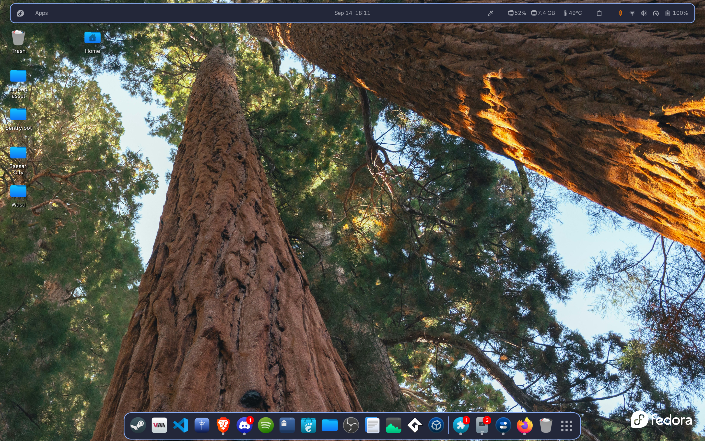

<div align="center">
  
  <p align="center">
    <strong>Aesthetic, Cohesive &amp; Modern Catppuccin Macchiato Desktop Setup for GNOME</strong>
  </p>
  <p align="center">
    
    
    
    
    
    <a href="LICENSE"></a>
  </p>
</div>

<br>

# 🌸 GNOME Catppuccin Macchiato Rice

A fully customized, production-ready desktop environment tailored for **GNOME Shell**, styled around the pastel aesthetics of **Catppuccin Macchiato**.

This repository contains everything required to reproduce the exact desktop look: GTK 3/4 & Libadwaita styling, GNOME Shell user themes, custom OpenBar floating panel presets, curated extensions, Kora icons, Bibata cursors, Nerd Fonts, terminal configurations (Ghostty, Fastfetch, Starship), and an automated single-command installer with zero manual friction.

---

## ✨ Highlights & Key Features

- 🎨 **Unified Catppuccin Palette**: Consistent color tokens across GTK3, GTK4/Libadwaita apps, Shell panel, menus, terminal, and desktop widgets.
- 🪟 **Floating & Transparent OpenBar**: Custom OpenBar profile with floating capsule styling, dynamic status indicators, and gradient accents.
- 💎 **Curved Windows & Ambient Blur**: Rounded corners with subtle Catppuccin border outlines alongside system-wide Gaussian blur effects.
- 🚀 **1-Click Automated Setup**: Hassle-free deployment with `install.sh` that detects packages, copies all assets, and applies clean dconf presets.
- 🛡️ **Safe & Reversible**: Includes a dedicated `backup.sh` script to snapshot your existing GNOME configurations before making changes.
- 💻 **Modern Terminal Suite**: Pre-configured configurations for Ghostty terminal, Starship cross-shell prompt, Fastfetch system info, btop, and cava audio visualizer.
- 🐭 **Wiggly Animated Pointer**: Includes custom cursor sprites and configuration for playful desktop interactions.

---

## 🎨 Theme & Style Breakdown

| Component | Specification | Description |
| :--- | :--- | :--- |
| **GTK 3/4 Theme** | `Catppuccin-B-MB-Dark-Macchiato` | Complete theme for GTK3 and GTK4 Libadwaita applications |
| **Shell Theme** | `Catppuccin-B-MB-Dark-Macchiato` | Applied via User Themes extension for top bar and popups |
| **Top Bar** | `OpenBar` (`catppuccin.theme`) | Floating capsule bar with custom padding, radius, and color harmony |
| **Dock** | `Dash to Dock` | Centered bottom dock with auto-hide and tuned icon scaling |
| **App Menu** | `ArcMenu` | Categorized launcher equipped with custom symbolic Fedora branding |
| **Icon Theme** | `kora` | Colorful, modern flat icon set compatible with all desktop apps |
| **Cursor Theme** | `Bibata-Modern-Classic` | Sharp and aesthetic cursor package |
| **Window Corners** | `Rounded Window Corners Reborn` | 15px radius with matching pastel accent border highlights |
| **Blur Engine** | `Blur my Shell` | Smooth background blur for overview, dock, panels, and lockscreen |
| **Hardware Monitor** | `Vitals` | Real-time ACPI CPU temperatures, RAM usage, and sensor metrics |
| **Typography** | `Adwaita Mono` & `JetBrainsMono NF` | Monospace nerd fonts with complete glyph and icon support |
| **Wallpaper** | Catppuccin Landscape | High-resolution 4K vector artwork centered on the Macchiato scheme |

---

## 🧩 Included GNOME Shell Extensions

All extensions are bundled in the `extensions/` directory and enabled automatically during installation:

| Extension | UUID | Purpose |
| :--- | :--- | :--- |
| **OpenBar** | `openbar@neuromorph` | Custom floating top panel and status styling |
| **User Themes** | `user-theme@gnome-shell-extensions.gcampax.github.com` | Custom GNOME Shell theme loader |
| **ArcMenu** | `arcmenu@arcmenu.com` | Modern, fully configurable application menu |
| **Dash to Dock** | `dash-to-dock@micxgx.gmail.com` | Customizable macOS-style application dock |
| **Blur my Shell** | `blur-my-shell@aunetx` | Gaussian blur pipeline for GNOME desktop elements |
| **Rounded Window Corners** | `rounded-window-corners@fxgn` | Window border radius & outline smoothing |
| **Just Perfection** | `just-perfection-desktop@just-perfection` | Desktop interface behavior and visibility tweaks |
| **Vitals** | `Vitals@CoreCoding.com` | Hardware telemetry directly in the top panel |
| **Color Picker** | `color-picker@tuberry` | Quick eye-dropper color utility |
| **Clipboard History** | `clipboard-history@alexsaveau.dev` | Persistent clipboard manager for panel |
| **Caffeine** | `caffeine@patapon.info` | Inhibit screen sleep and lock toggle |
| **Desktop Icons NG** | `gtk4-ding@smedius.gitlab.com` | Desktop icons support for Wayland / X11 |
| **Wiggly** | `wiggly@mojarch` | Custom wobbling pointer effects with bundled sprite |

---

## 🚀 Quick Installation

### 1. Clone the repository
```bash
git clone https://github.com/lexp-hub/catppuccin-gnome-rice.git
cd catppuccin-gnome-rice
```

### 2. (Recommended) Backup your current GNOME settings
```bash
chmod +x backup.sh
./backup.sh
```

### 3. Run the installer
```bash
chmod +x install.sh
./install.sh
```

### 4. Restart GNOME Session
- **Wayland**: Log out and log back into your session.
- **X11**: Press <kbd>Alt</kbd> + <kbd>F2</kbd>, type `r`, and press <kbd>Enter</kbd>.

---

## ⚙️ OpenBar Theme Import

The installer automatically deploys `catppuccin.theme` to your home directory and configures OpenBar.

If you wish to manually re-import or edit the preset:
1. Open **OpenBar Preferences** from your GNOME Extensions list or *Extension Manager*.
2. Navigate to the **Import / Export** tab.
3. Click **Import** and choose the `~/catppuccin.theme` file (or `openbar-catppuccin.theme` inside this repo).
4. Click **Reload Style** to apply.

---

## 📁 Repository Structure

```text
├── assets/
│   └── mouse.png                     # Custom cursor sprite for Wiggly extension
├── config/
│   ├── btop/                         # btop system monitor Catppuccin theme
│   ├── cava/                         # Cava audio visualizer configuration
│   ├── fastfetch/                    # Fastfetch config, logos, and gradients
│   ├── ghostty/                      # Ghostty terminal styling and GLSL shaders
│   ├── gtk-3.0/                      # GTK 3 custom stylesheets & dark mode presets
│   ├── gtk-4.0/                      # GTK 4 / Libadwaita stylesheets & dark mode presets
│   └── starship.toml                 # Starship prompt configuration
├── dconf/
│   ├── catppuccin.theme              # Standalone OpenBar theme preset
│   ├── dconf-clean.ini               # Clean, portable dconf database
│   └── dconf-settings.ini            # Full raw dconf settings export
├── extensions/                       # Pre-packaged GNOME Shell extensions
├── fonts/                            # Adwaita Mono, JetBrains Mono & Cascadia fonts
├── icons/
│   ├── Bibata-Modern-Classic/        # Bibata cursor theme
│   └── kora/                         # Kora icon theme
├── themes/
│   └── Catppuccin-B-MB-Dark-Macchiato/ # GTK 3/4 & GNOME Shell theme
├── wallpapers/
│   └── catppuccin-wallpaper.jpg      # High-res Catppuccin desktop wallpaper
├── install.sh                        # Automated setup & restoration script
├── backup.sh                         # Safety configuration backup tool
├── openbar-catppuccin.theme          # Standalone OpenBar theme file
├── LICENSE                           # MIT License
└── README.md                         # Documentation
```

---

## 🛠️ Requirements & Compatibility

- **Operating System**: Fedora, Arch Linux, Ubuntu, Debian, or any Linux distribution running GNOME.
- **GNOME Shell**: Versions `45`, `46`, `47`, `48`, `49`, `50+`.
- **System Utilities**: `dconf`, `gsettings`, `fontconfig`, `gnome-tweaks`, `unzip`.

---

## 📜 License

Distributed under the [MIT](LICENSE) License. Built with 💜 by [lexp-hub](https://github.com/lexp-hub).


sudo bash -c '
mv /etc/gdm/custom.conf /etc/gdm/custom.conf.bak 2>/dev/null
cat << "EOF" > /etc/gdm/custom.conf
[daemon]
[security]
[debug]
EOF

rm -rf /var/lib/gdm/.config /var/lib/gdm/.local /var/lib/gdm/.cache /etc/dconf/db/gdm.d
chown -R gdm:gdm /var/lib/gdm

dnf reinstall -y gdm gnome-shell
restorecon -Rv /etc/gdm /var/lib/gdm /usr/share/gnome-shell

systemctl restart gdm
'

